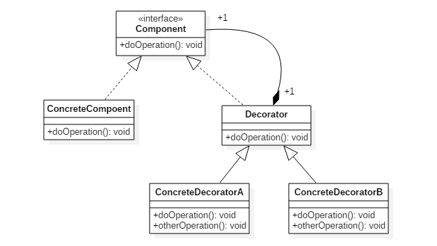

# 装饰者模式

## 结构


## 代码
```java
public interface Beverage {
    double cost();
}


public class DarkRoast implements Beverage {
    @Override
    public double cost() {
        return 1;
    }
}

public class HouseBlend implements Beverage {
    @Override
    public double cost() {
        return 1;
    }
}

public abstract class CondimentDecorator implements Beverage {
    protected Beverage beverage;
}

public class Milk extends CondimentDecorator {

    public Milk(Beverage beverage) {
        this.beverage = beverage;
    }

    @Override
    public double cost() {
        return 1 + beverage.cost();
    }
}
  

public class Mocha extends CondimentDecorator {

    public Mocha(Beverage beverage) {
        this.beverage = beverage;
    }

    @Override
    public double cost() {
        return 1 + beverage.cost();
    }
}

public class Client {
    public static void main(String[] args) {
        Beverage beverage = new HouseBlend();
        beverage = new Mocha(beverage);
        beverage = new Milk(beverage);
        System.out.println(beverage.cost());
    }
}
```

## 设计原则
类应该对扩展开放，对修改关闭: 也就是添加新功能时不需要修改代码。饮料可以动态添加新的配料，而不需要去修改饮料的代码。  
不可能把所有的类设计成都满足这一原则，应当把该原则应用于最有可能发生改变的地方

## 使用场景
* java io类
* 灰度负载均衡策略

